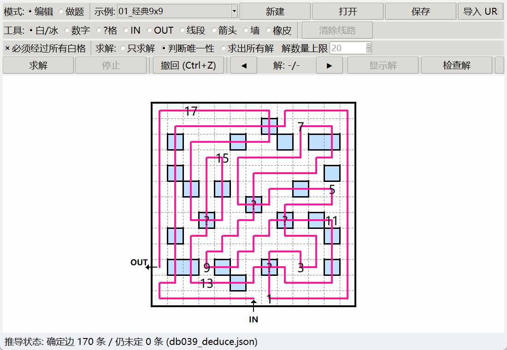
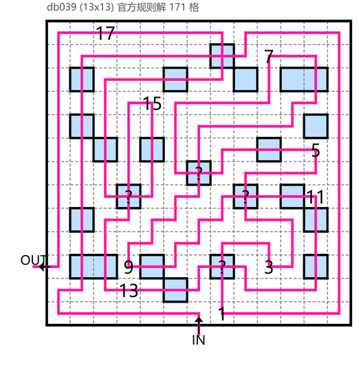

# 冰宫巡游 (IceLom) 通用求解器

带图形界面的 IceLom（アイスローム，Nikoli vol.128 起源）通用求解器。
**前端 Python tkinter，后端 C++（MinGW g++ 编译）。**
求解核心：**规则级约束传播 + 单边试连接（推到不动点）+ 固定顺序枚举** ——
把 [`tools/deduce.py`](tools/deduce.py) 的那套确定性推理搬进了 C++ 求解器：
格内配置 / 冰格直行 / 连通无环可达 / 相邻已知数字 / "?" 位次模型，再加「逐格逐方向试连接 +
路径检查」；绝大多数题**一个搜索分支都不用**就推完了（65 题基准里 35 题 0 分支节点，
包括曾经 300 s 搜不出的 db039）。数字按**位次规则**判定（**不必连续**，
支持 **"?" 格**——数字未知的编号格）。
做题模式为 **puzz.link 式多段画线 + 规则引擎**（判定语义与 pzprjs 官方引擎差分核对）：
可分数段作画、可在 IN/OUT 处画出界外，实时校验、**检查解**、**对照解**（验证"是解的一部分"）。



*界面（tkinter）：编辑 / 做题 / 求解三种模式，puzz.link 式多段画线 + 规则引擎实时校验。
上图是 13×13 的 db039：规则推导器把整条 171 格线路**推完**（确定边 170 条、仍未定 0 条）。*



*`icelom_render.py` 的离屏渲染（Nikoli 纸面风格，可导出 PNG）。*

> 📚 文档：[`docs/项目架构.md`](docs/项目架构.md)（目录职责与数据流）·
> [`docs/算法说明.md`](docs/算法说明.md)（算法与实现细节）·
> [`docs/求解器协议.md`](docs/求解器协议.md)（JSON 接口契约）·
> [`docs/测试与验证.md`](docs/测试与验证.md)（测试体系）·
> [`docs/资源与官方判别器.md`](docs/资源与官方判别器.md)（依赖与官方引擎判定）

## 下载（Windows 免安装，给只想用的人）

到 [Releases](https://github.com/ProximaCentauri0/Icelom/releases) 下载
`IceLom-<版本>-win64.zip`（约 0.4 MB）：解压后

```
python icelom_gui.py
```

即可，**不需要编译器、不需要联网** —— 求解器是**静态链接的单文件 exe**（无 DLL 依赖），
题面与 URL 解码库都在包里。只要机器上有 **Python 3.8+（自带 tkinter）**；导出 PNG 另需 Pillow。

> 压缩包里只有"运行必需"的东西：界面 + 静态 exe + 图标 + 11 道示例题面 + URL 解码器 + 包内 README。
> **源码、测试、65 题基准、算法文档都在本仓库里**，不在压缩包里。

## 规则

以下规则已用 **pzprjs 官方引擎 check() 探针**逐一验证
（见 `tests/probe_rules.js`，起终点冰格转弯均报 `lnCurveOnIce`）：

1. 从 **IN** 进入、**OUT** 离开，画一条**不分叉、不重叠**的单一线路，线路走格子中心，横竖相连。
2. **白格**：至多经过一次，格内可转弯。默认要求**所有白格都必须被经过**（界面可勾选关闭；
   关闭后不要求覆盖全部白格，解会变多）。
3. **冰格（蓝格）**：不能转弯（进入后必须直行穿出），**允许垂直交叉**（每格横、竖各最多一次，
   禁止同轴重叠）；冰格不必全部经过。
   **IN/OUT 可以放在冰格上**：冰上 IN 出发后必须直行（pzpr 官方题即如此）；
   冰上 OUT 出框那一次必须从格内沿出框方向直行穿出，出框前允许被垂直方向
   交叉穿过一次再折返（白质 OUT 因至多经过一次，进入后必直接出框）。
4. **编号格与 "?" 格**：线路按**升序**经过编号格。
   - 已知数字格：每个恰好经过一次（数字可放白格或冰格；冰上数字格只直行通过一次、不可被交叉）。
   - **"?" 格**：**数字未知**的编号格（格子本身在白题面里就确定是白格还是冰格，只是数字没印）。
     **"?" 冰格允许被十字交叉穿过两次**（横竖各一次），每次穿越各占一个编号位次 ——
     同一个 "?" 格两次穿越可以是**两个不同的数**（作者官方示例：`1 → ?(2) → ?(3) → 4` 正解）。
   - **判定规则（与 pzpr 官方 `checkNumberOrder` 完全一致）**：把线路上经过的编号格依次记为
     第 `1,2,3…` 位（已知数字格每次经过算 1 位，"?" 格的每一次穿越也算 1 位），
     则**已知数字 `v` 必须正好落在第 `v` 位**。这等价于：**线上数字不允许跳跃、必须连续**
     （`1,2,3,…,T`），题面印出的数字只是其中**没有被 "?" 替换的那些** —— 所以 `2?4` 只能是
     `2,3,4`，而 `2?5` 不合法（3、4 无处安放）。
     作者题面的惯例是**首尾两个数字不写成 "?"**（如 db039 的 `1,?,3,?,5,…,?,17`）；
     注意官方判定本身并不强制这一点：db034 的唯一解位次是 `1,?,3,4,5,6,7,8,?`（末位是 "?"），
     已用官方引擎核对为**正解**（`tools/official_check.py`）。
   - 所有编号格（含 "?"）都必须被线路至少经过一次。
   - 由"已知数字 v 必须落在第 v 位"还能推出一条**计数**结论：若
     `已知数字格数 + 2×("?" 冰格数) + 1×("?" 白格数)` 恰好等于题面最大数字（**修满上限才刚好
     够 ⇒ 没有余量**），则每个 "?" 冰格**必须**被十字交叉穿越两次（求解器据此强制：
     `initQmarkNeeds`；有余量时推不出这一条）。db039 正是这种情况（9 + 2×4 = 17）。
5. **格间标记**（放在相邻两格的公共边或外边框上）：
   - **线段**：线路必须经过这条边（方向任意）；
   - **箭头**：线路必须按箭头方向经过这条边；
   - **墙**：线路禁止经过这条边。
   外边框上的标记只有 IN/OUT 所在边能被满足（线路只能从 IN 进、OUT 出），
   其它位置的边框标记会被求解器判为无解并给出原因。

> 玩法名与官方引擎：这是 **アイスローム（IceLom）**，在 [pzprjs](https://github.com/robx/pzprjs)
> 里的 id 是 **`icelom`**（与 `icebarn`、`icelom2` 同属 `src/variety/icebarn.js` 定义的变体家族；
> 不带数字、只用成对箭头的那个玩法才是 `icebarn`）。本项目唯一一处**有意**用 `icebarn` 的地方
> 是"判箭头"的官方差分测试：pzprjs 对 pid `icelom` 会整条跳过内部箭头校验，详见
> [`docs/资源与官方判别器.md`](docs/资源与官方判别器.md) §4.2。

## 快速开始

脚本入口是 `tools/taskset.ps1`（Windows PowerShell；每个任务都是"编译/测试/打包"这类固定命令）：

```powershell
powershell -NoProfile -File tools/taskset.ps1 build      # 编译求解器
powershell -NoProfile -File tools/taskset.ps1 test       # 核心回归 T1–T16
powershell -NoProfile -File tools/taskset.ps1 gui        # 启动界面
powershell -NoProfile -File tools/taskset.ps1 help       # 全部任务（benchmark/audit/selftest/check/clean…）
```

等价的裸命令：

```powershell
g++ -O2 -std=c++17 -Wall -o icelom_solver.exe icelom_solver.cpp   # 需要 PATH 上有 g++（MinGW-w64）
python -X utf8 icelom_gui.py
python -X utf8 icelom_gui.py --selftest        # 冒烟自测（自动求解 + 截图）
```

pzprjs 官方解码器如需重建（源码树已精简到 `tools/pzprjs/`）：

```powershell
node tools/build_concat.js        # 或 powershell -NoProfile -File tools/taskset.ps1 build-pzpr
```

## 文件

| 文件 / 目录 | 说明 |
| --- | --- |
| `icelom_solver.cpp` / `icelom_solver.exe` | C++ 求解后端（stdin 收 JSON，stdout 流式输出 JSON Lines） |
| `icelom_gui.py` | Python tkinter 图形界面（编辑器 + 求解 + puzz.link 式多段画线 + 规则引擎「检查解」/「对照解」） |
| `icelom_render.py` | 离屏 PNG 渲染器（Nikoli 纸面风格，4 倍超采样抗锯齿；需要 Pillow） |
| `build.py` | 编译求解器（自动找 g++；`--static` 可做不依赖 DLL 的单文件） |
| `assets/` | 图标：`icelom.ico`（多尺寸）+ 预览 PNG + 那道 2×2 题面；由 `tools/make_icon.py` 生成 |
| `docs/` | 架构 / 算法 / 求解器协议 / 测试体系 / 依赖与官方判别器 |
| `example/` | GUI 示例题（下拉框数据源，11 道；见 `example/README.md`） |
| `benchmark/` | 65 道真实题面的性能基准 + 计时/验证/报告工具（见 `benchmark/README.md`、`benchmark/REPORT.md`） |
| `tools/` | URL 导入、官方判定、长跑求解、渲染、**规则推导器（`deduce.py` / `deduce_report.py`）**、示例生成、图标生成、`taskset.ps1`、vendored `pzprjs/` |
| `tests/` | 回归测试、独立验证器、独立求解模型、官方引擎差分、GUI 测试（见 `docs/测试与验证.md`） |
| `analysis/` | 生成的分析产物（db039 的解/位次报告/渲染图/规则推导状态与推导图、审计报告；见 `analysis/README.md`） |

## 使用

```
python icelom_gui.py
```

### 任务栏图标 / 快捷方式（Windows）

用 `python icelom_gui.py` 启动时**进程是 python.exe**，Windows 任务栏默认按进程取图标，
所以任务栏可能是空白/python 图标——窗口里设 `iconbitmap` 改不了它。正确做法是
**从一个带图标的快捷方式启动**，程序会自己安排好：

- **第一次运行**弹一句"要不要在桌面建一个带图标的快捷方式？"——**只问这一次**
  （记在 `%APPDATA%/IceLom/gui.json`）；
- 选「是」→ 建桌面快捷方式；桌面写不进去（权限/受限环境）→ 自动退到程序目录里建一个；
- 选「否」→ 直接在**程序目录**里建 `IceLom 冰宫巡游.lnk`，不再打扰；
- 之后随时可以在菜单 **文件 → 创建桌面快捷方式（带图标）** 里补建。

命令行也可以：

```powershell
python -X utf8 tools/make_shortcut.py                  # 桌面 + 开始菜单 + 项目目录
python -X utf8 tools/make_shortcut.py --desktop        # 只要桌面那个
python -X utf8 tools/make_shortcut.py --here           # 项目目录里的 IceLom 冰宫巡游.lnk
```

它会做三件事：

1. 建 `.lnk`：目标 `pythonw.exe`、参数 `-X utf8 icelom_gui.py`、**图标 `assets/icelom.ico`**；
2. 给 `.lnk` 写入 **AppUserModelID `Icelom.Solver.GUI`** —— 任务栏靠它把窗口和快捷方式配对；
3. 生成 `tools/launch_icelom.cmd`（不想用快捷方式时双击它也行）。

`icelom_gui.py` 启动时会用 `SetCurrentProcessExplicitAppUserModelID` 设**同一个** AppUserModelID，
两边对得上，任务栏就显示 IceLom 的图标。改了 `assets/icelom.ico` 后重跑一次脚本即可。

> 图标本身是**分尺寸**的：16/24/32/48/64 px 用"简化版"（粗外框 + 蓝色 "?" 冰格 + 一条粉线，
> 去掉数字与细虚线），128/256 px 用完整题面版 —— 任务栏只给 16~32 px，
> 把完整版硬缩到那么小会糊成一团（本项目实测过，正是任务栏"看不清"的原因）。

### 编辑谜题

- **模式**: 顶部可切换 **编辑 / 做题** 两种模式（做题模式见下节）。
- **网格随窗口自动缩放并居中**（拉大缩小窗口即可；**放大不再有上限**，全屏时盘面会铺满可用区域）。
- **示例**: 顶部下拉框列出 `example/` 文件夹里的示例题（含 benchmark 精选与
  内部 IN/OUT、角冰格两个新特性演示），选中即加载。
- **白/冰**：点击涂一个格，**按住拖动可连续涂一片**（一笔只占一条撤销记录）。
- **数字**：工具条上有一个**数字选择器**（`数字 [ 4 ▲▼ ]`），它就是"数字工具下一个要放的数"：
  - **直接输入**要放的数（可以故意输重复的，见下）；
  - **↑ ↓ 会跳过盘面上已有的数字**，于是连续点击自动得到 1,2,3,…；也可以先跳到 7 再放；
  - **点击空格**放下这个数，放完选择器自动跳到下一个"还没被占用"的数字；
  - **点击已有数字的格**= 删除该数字（选择器不动）。
  - **数字重复 = 题面无效**：同一个已知数字出现在两格（手输重复就会发生），这些格会**整格变成黄色**
    并在状态栏提示 `⚠ 题目无效: 数字重复 N((x,y)/(x,y))`；删掉多余的即可。
    注意**跳号（1,3,5…）是合法的**，不会报警。
- **?格**：点击格子放置/取消 **"?" 格**（数字未知的编号格），冰格上也可以放，
  界面上画成 "?"。它**不受数字选择器影响**——这正是做"`1,?,3,?` 这种问号题"的用法：
  用数字工具按选择器放已知数字，用 "?格" 工具点出未知编号格。
- **IN / OUT**：**点击格子**放置（再点同格取消，放置会顶掉同格的另一端点）：
  - **内部格**：线路以该格格心为起/终点，格内显示带衬底的 IN/OUT 字样，无箭头；
  - **边界格**：显示入/出界黑色箭头（方向自动生成），标签画在框外、避开箭头与线路；
  - **角上的冰格**：入/出界方向不唯一，点击后进入"指定方向"流程——再点击相邻格
    （IN=线路去向、OUT=线路来向）完成设置，Esc 取消。
- **线段 / 箭头 / 墙**：**点击起点格再点击相邻格（或直接拖动）**即生成，
  **箭头方向 = 行进方向**；重复创建同一线段/箭头/墙取消；每次创建完成后**不保留任何
  选择状态**——想画反向箭头必须从头重新选起点，想删箭头就从头再创建一次相同的箭头。
  起点格选定后按 **Esc** 取消。
- **橡皮**：清除格子内容或边标记（**右键**任何时候都是橡皮；做题模式右键=清除线路）。
- **Ctrl+Z** 或"撤回"按钮撤销；求解中撤回会**先打断求解**；行列数改后点"调整大小"；
  谜题可 保存/打开（JSON）。

### 做题模式 (自己解谜)

- 切到"**做题**"模式后**按住拖动即可画线**（与 puzz.link 的做题手感一致）：
  - **可画任意多段线路**：可以从任意格起笔，之后再把各段连成一体；
  - **路径可以在 IN/OUT 处垂直伸出界外一格**（从界外拖进盘中即可画出这段）；
  - **拖过已有的线段 = 擦除**，**拖回上一步 = 回退**；右键或"清除线路"清空；
  - 一次拖动 = 一条撤销记录（Ctrl+Z 整笔撤回）；线路**不画端点圆点**。
- **规则引擎实时校验**（判定语义与 pzprjs 官方做题引擎一致）：分叉 / 白格十字交叉 /
  冰格转弯 / 穿墙 / 逆箭头 / 从非 OUT 处越出边框 / 数字位次错误 / 游离线段
  → 线路变**橙色**并在状态栏提示（未画完时只提示"还差多少项"，不算画错）；
  完成且满足全部要求时变**绿色**并提示 🎉。
- "**检查解**"按钮: 用规则引擎判定当前线路**是否已构成满足要求的解**
  （不依赖求解器，等价于 puzz.link 的 Answer Check）；
- **可以边做题边求解**: 求解不会覆盖做题界面——找到解后用"**显示解 / 隐藏解**"
  按钮切换: **显示解时只看答案**(做题线路暂时隐藏), 点"隐藏解"回到做题界面;
  没做过题时求解后直接显示解, 点"隐藏解"回到题面。
- "**对照解**"按钮: 验证当前线路**是答案的一部分**（即**没有画出错误的连接**），
  **只输出 正确/错误**，不提示错在哪里。不比方向、不比起终点 —— 照抄解、
  只画了一部分、或反着画都算"正确"；只要出现一条与答案冲突的连接就是"错误"。
  （若还没求出答案，会先静默求解一次再比对。）

### 导入 / 导出

- **导入 URL**：粘贴 puzz.link / pzv.jp 的 icelom 谜题 URL（如
  `https://puzz.link/p?icelom/a/8/8/.../0/15`），经官方 pzprjs 库解码为本地谜题；
  **数字保持题面原值**（不重编号），题面里的 "?" 格解码为 `n = -2`。需要 Node.js。
- **导出解为图片**：把当前谜题（优先当前显示的解, 其次做题线路）按纸面风格**离屏重绘**成
  高分辨率 PNG（64px/格、4 倍超采样抗锯齿, 需要 Pillow；不再依赖屏幕截图）。

### 求解

- 勾选/取消"**必须经过所有白格**"（默认勾选，即官方规则）。
- **求解模式**（**默认「判断唯一性」**）：
  - **判断唯一性**（默认）：穷尽搜索找一个解, 报告"解是唯一的"或"解不唯一(至少 2 个)"
    并列出两个解（被时限截断时保守报"不唯一"）;
  - **只求解**：找到第一个解立即返回（最快）;
  - **求出所有解**：枚举全部解, 用"解数量上限"控制（默认 20, 仅此模式可设）。
- 求解过程实时显示已找到的解数量，可随时"停止"；用 ◀ ▶ 在多个解之间切换查看；
  状态栏显示节点数与耗时。
- 求解在**后台静默**进行：不会弹出控制台黑窗（界面由 `pythonw`/快捷方式启动时自身没有
  控制台，跨进程启动求解器或 `node` 必须显式抑制控制台，见 `icelom_gui.py:_no_console`）。
- **"无解"不等于出错**：搜遍全树仍无解时，求解器会往 stderr 打印 `[unsat-diag]` **最深现场
  盘面 + 开放端点**（stderr 是**诊断通道，不属于求解协议**）。界面**不会**因此弹错误框——
  想看现场就用 **查看 → 求解器诊断…**（**Ctrl+D**）打开只读窗口（可选中复制）；
  只有求解器**非零退出码**（崩溃）才算真异常，那时才弹"求解器异常退出"并附上 stderr 尾巴。
- `options.symmetry_retry`（界面仍会带上）现在是**死开关**：求解器只有**一颗搜索树、
  一个固定的分支顺序**，读进来后完全不参与判定。

## JSON 格式（保存文件 / 求解器输入）

```json
{
  "format": "icelom-v1",
  "w": 9, "h": 9,
  "cells": ["w","i", ...],                      // 长度 w*h, 行主序 index=y*w+x, "w"白 "i"冰
  "numbers": [{"x":0,"y":0,"n":8}, {"x":3,"y":7,"n":-2}, ...],  // n>0 已知数字; n=-2 = "?" 格
  "in":  {"x":0,"y":4,"side":"L"},              // side ∈ R/D/L/U, 进入方向 = side 反方向
  "out": {"x":8,"y":4,"side":"R"},              // 离开方向 = side 方向; IN/OUT 可在冰格上
  "edges": [{"x":2,"y":4,"side":"R","kind":"arrow","dir":"R"}, ...],
  "options": {"cover_all_whites": true, "symmetry_retry": true},
  "limits": {"mode": "all", "max_solutions": 1000, "time_limit_ms": 120000}
}
```

`numbers[].n`：`> 0` 为已知数字（**题面可跳号**，同一数字不可重复），
`-2` 为 **"?" 格**（数字未知的编号格，与 pzpr 的 `qnum` 编码一致）。

`options.symmetry_retry`（可选）：**已废弃的旧开关** —— 它曾经表示"第一轮没出结论时再换
逆向扫描序搜一遍"。求解器现在是**单颗搜索树 + 单一固定顺序**（不做换序、不做盘面 D4 变换），
该字段**根本不会被求解器解析**；保留只为兼容 GUI 与旧脚本的请求。
`limits.time_limit_ms` 就是整次求解的时限。求解器**不再对输入朝向敏感**：db039 在 8 个朝向
下都是 0 分支节点、毫秒级出解（回归见 `tests/run_tests.py` T16）。原理与实测见
[`docs/算法说明.md`](docs/算法说明.md) §3.5–3.13。

`limits.mode` ∈ `first`（只求一个）/ `unique`（判唯一性）/ `all`（枚举，默认；旧协议下
`max_solutions == 1` 亦按 `unique` 处理）。

`edges.kind` ∈ `segment` / `arrow` / `wall`；`side` 表示标记位于格子 (x,y) 的哪一侧。
输出为 JSON Lines：每个解一行 `{"type":"solution","index":i,"path":[[x,y],...]}`
（path 含冰格交叉时的重复经过），最后 `{"type":"done","count":...,"nodes":...,"ms":...}`；
输入不合法时输出 `{"type":"error","message":...}`，结构性无解（如墙堵住 IN）在 done 行给出 `reason`。
**完整字段表、默认值与全部报错文案见 [`docs/求解器协议.md`](docs/求解器协议.md)。**

## 测试

```powershell
python -X utf8 tests\run_tests.py         # 求解器回归 T1–T16（含独立验证器逐解核对 + "?" 格 13 例 + 箭头方向 6 例 + 8 个朝向的坐标往返 + db039 纯推理回归）
python -X utf8 tools\measure_transforms.py --benchmark-matrix  # 65 题 × 8 朝向的耗时矩阵（旧引擎用来查"方向敏感性"）
python -X utf8 tests\fuzz_diff.py 300     # 一致性模糊测试：主求解器 ↔ 独立模型 ↔ 独立验证器
python -X utf8 tests\audit_benchmark.py 60  # 基准 65 题双模型交叉审计 → analysis\audit_report.txt
python -X utf8 tests\test_url_import.py   # puzz.link URL 导入：双解码比对 + 求解验证
python -X utf8 tests\solver_newapi_test.py  # 求解模式 / 内部与角冰格 IN/OUT / 旧开关兼容
python -X utf8 tests\gui_logic_test.py    # GUI 无头逻辑（交互 API / 求解模式 / 撤销 / 导入管线）
python -X utf8 tests\gui_visual_test.py   # GUI 截图可视化（需要可见桌面 + Pillow）
python -X utf8 tests\check_engine_pzprjs.py   # 做题规则引擎 vs pzprjs 官方引擎（17 状态，箭头状态走 pid icebarn）
python -X utf8 tests\check_engine_examples.py # 规则引擎 vs 求解器答案 + 独立验证器（example/ 全量）
python -X utf8 tests\deduce_test.py       # 规则推导器回归（确定边不许推错 / "?" 计数推论 / db039 确定边 ≥ 35）
python -X utf8 tools\deduce_report.py benchmark\puzzles\db039_13x13_0vanillaice0.json --solution analysis\db039_solution.json --png analysis\db039_deduce.png   # "光靠规则能推到哪一步"的推导报告
python -X utf8 tools\official_check.py db039  # 官方引擎判定某个解：PASS / failcode
node tests\probe_rules.js                 # pzprjs 官方引擎规则语义探针
python -X utf8 benchmark\run_benchmark.py # 性能基准：65 道真实题面（计时 + 独立验证 + 报告）
python -X utf8 icelom_gui.py --selftest   # GUI 冒烟自测
powershell -NoProfile -File tools\taskset.ps1 test-all   # 上面大部分测试的合并入口
```

逐条说明（每条测什么、需要什么、出问题先看哪条判据）见 [`docs/测试与验证.md`](docs/测试与验证.md)。

关键交叉验证结果：

- 9×9 经典题（`example/01_经典9x9.json`）：覆盖模式 **1 解**（~0.1s）；关闭覆盖后 **3 解**
  （这两个数字由 `tests/run_tests.py` 的 **T7** 钉住，且每个解都通过独立验证器）——
  与原单题求解器的历史结论一致；
- 8×8 博客真题（アイスローム４）：**1 解**，且线路**不经过任何冰格**，与博客评论区预期一致；
  8×8 博客题 URL 导入：解码结果与人工转录**逐格一致**，求解同为 1 解；
- 箭头题 `example/11_20260909_9x9.json`（9×9、26 冰、10 条箭头）：**1 解**，且该解在官方引擎下
  也 PASS（判箭头要用 pid `icebarn`：pzprjs 对 pid `icelom` 会**整条跳过**箭头检查，
  见 [`docs/资源与官方判别器.md`](docs/资源与官方判别器.md) §4.2）。由 `tests/run_tests.py` **T14** 钉住 ——
  修复"孤立强制边分量不校验箭头方向"之前，这题会给出 7 个"解"、其中 6 个逆着箭头走；
- 一致性模糊测试 738 个随机盘面（含高冰密度、冰上数字）：主求解器、独立走廊收缩模型、
  独立验证器**三方零差异**；
- 3 条 `v:/` 变体题被剔除（非标准规则）；含 **"?" 格** 的 db034（2 个）与 db039（4 个）均已支持；
- 基准 65 题（`python benchmark/run_benchmark.py` → [`benchmark/REPORT.md`](benchmark/REPORT.md)）：
  **65 题全部唯一解、0 超时**，65 题 × 3 遍总墙钟 **约 5 s**（每遍约 20 ms 是进程启动开销；
  求解器自报耗时中位数在 1 ms 量级）。**35 题一个搜索分支都没用**（`nodes = 0`，纯推理推完），
  另有 24 题 1~66 个分支节点，最慢的 db048 也只有 2092 个节点 / 约 200 ms；
- **db039 不再是难例**（13×13、23 冰、4 个 "?"、数字 1,3,…,17）：旧引擎在题面朝向下 300 s
  搜不出、换朝向才 2~12 s，现在**任何朝向都是 0 分支节点、2 ms 出解**（`tests/run_tests.py`
  T16 逐个朝向钉住）。解为 171 格线路，编号位次恰是 `1,?(2),3,?(4),…,?(16),17`，
  独立验证器通过，并已用 **pzpr 官方引擎 `check()` 判定 PASS**（`tools/official_check.py`）；
  与"把作者提示作为强制边"求得的解**逐格完全相同**。产物：`analysis/db039_solution.json`、
  渲染图 `analysis/db039_solution.png`、报告 `analysis/db039_report.txt`；
- **同一个推理层在 `tools/deduce.py` 里也有独立实现**（`tools/deduce_report.py` 出报告）：
  **逐格扫、逐方向试连接、有更新就从第一个格重扫，直到一整轮没有更新**（确定性、无搜索、无递归）。
  每格每条候选边分别试"用"与试"禁"：试连不可行 ⇒ 该方向禁；禁掉就没走法 ⇒ 该边必用；
  只剩一种走法 ⇒ 直接定。试连时沿方向走下去（**冰格必须直行 ⇒ 接着冰格那条边必被用**），
  撞到度数已满/穿不过的格 ⇒ 该方向不可行，撞到别的段端点 ⇒ **路径合并 + 路径检查**：
  数字必须逐个递增不跳跃、起点是 IN 时第一个必须是 1、**未达最大数字不能碰 OUT**、
  "?" 当通配符在位次选择集里取值（存在赋值即可行）。
  实测：**db039 的整条 171 格线路被推完** —— 170 条确定边 / 142 条被排除 / **0 条未定**（0.8 s），
  其中 `9→左`、`9→下` 都被判不可行 ⇒ 9 的需求度数是 2 ⇒ **9 必连上方与右方**。
  同一套机制在 **db042（10×10）上同样把整条线路 84 条边推完**。
  全量审计（`python tools/audit_deduce.py 8` → `analysis/deduce_audit.txt`，65 道基准题）：
  **0 题推错、0 题误禁、0 题假矛盾，33 题被推理直接推完整条线路**且逐题通过独立验证。
  "?" 代表的数字集合也被计数唯一确定为 `2,4,6,8,10,12,14,16`。推导状态可以直接在界面上看：
  `python icelom_gui.py --state analysis/db039_deduce.json`；
- 全部解通过独立验证器；标准题另用**独立走廊收缩模型**（`tests/indep_solver.py`）
  交叉核对（`tests/audit_benchmark.py` → `analysis/audit_report.txt`），报告里出现 `skip`
  行是该模型的能力边界（不支持冰质 OUT / 内部 IN/OUT），不是失败。

## 求解算法概要

1. **边三态 + 节点模型**：每条内部边只有"未定 / 必用 / 禁用"三态；白格 1 个节点、冰格 2 个
   节点（横轴/竖轴），IN/OUT 的入框/出框边（含内部 IN/OUT 的虚拟边）也算该格的一条连接。
   于是"穿越次数 = 连接总数 / 2"，白格度数 2、冰格每轴 0 或 2、已知数字恰好穿越一次、
   "?" 一次或两次（被计数强制时恰好两次）全都落在同一条判据里。
2. **推理到不动点**：格内配置枚举（共有边⇒必用、都不含⇒禁用、没有配置⇒矛盾）、
   相邻已知数字必须连续、连通/无环（节点级并查集）、可达性（格级放宽：到不了 IN/OUT 的格
   所有边禁用）、已用分量的路径检查。
3. **单边试连接 + 路径检查**（主力）：逐格逐方向试"用"与试"禁" —— 试"用"走不通
   （顺方向走撞死 / 路径检查不过）⇒ 必禁，试"禁"没走法 ⇒ 必用，剩下的走法共有的边 ⇒ 必用。
   走的时候**冰格必须直行**（接着冰格那条边必被用），白格沿已定边走、只剩唯一可用边时那条也必被用，
   否则去路未定就停。路径检查 = 官方 `checkNumberOrder`：数字逐个递增不跳跃 / 起点是 IN 时
   第一个必须是 1 / **未达最大数字不能碰 OUT** / "?" 的每次穿越落在允许位次上 / 箭头方向一致。
4. **固定顺序枚举**（推理推不动时才用）：按行主序找第一个还能分支的"必有格"，
   分支 = 决定该格的最终连接集合。**不做 MRV、不换扫描序、不换盘面朝向**。
5. **解的还原校验**：从 IN 沿已用边重建整条线路，逐条核对步法/度数/编号位次/箭头/
   "所有已用边都在这条线路上"/覆盖要求 —— 剪枝只影响速度，不影响正确性。
6. **回溯**：全部状态改动写入统一轨迹栈（边状态），逆序还原，热路径零分配。

算法细节（含每一条剪枝的必要性论证、GUI 交互状态机、URL 解码）见
[`docs/算法说明.md`](docs/算法说明.md)。

## 许可与第三方

- **本仓库代码**：MIT，见 [`LICENSE`](LICENSE)。
- **`tools/pzprjs/`**：官方引擎 [pzprjs](https://github.com/robx/pzprjs) 的构建产物（**MIT**：
  © 2011, 2014 Kobayashi, Daisuke (sabo2)；© 2019 Vollmert, Robert and contributors），
  随附 MIT 全文于 [`tools/pzprjs/LICENSE.txt`](tools/pzprjs/LICENSE.txt)。它只用于
  **URL 解码**与**官方 `check()` 交叉验证**，本项目未修改其代码（`pzpr.concat.js` 可用
  `node tools/build_concat.js` 从精简源码树逐字节重建）。
- **题面**（`benchmark/puzzles/`、`example/`）：来自作者**公开发布**的题目，经
  [puzz.link/db](https://puzz.link/db/) 收录并可逐题溯源到原作者与原链接（见
  [`benchmark/manifest.json`](benchmark/manifest.json)）；**题目版权归各作者**，
  这里只作求解器的输入数据。题目作者如希望移除，请开 issue。
- **玩法与规则**：アイスローム / IceLom 的规则版权归 Nikoli 所有；本仓库的规则说明是
  自行撰写的，未复制其规则文本或插图。
- 本仓库不是 Nikoli 官方作品，与 Nikoli 无关联。
